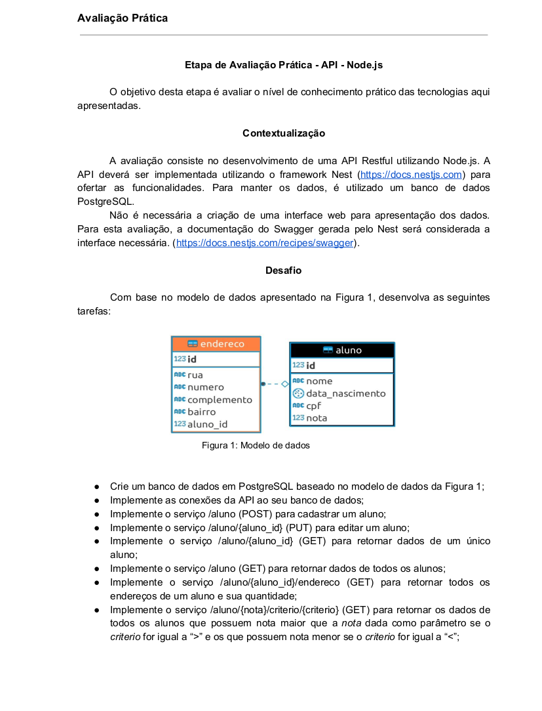
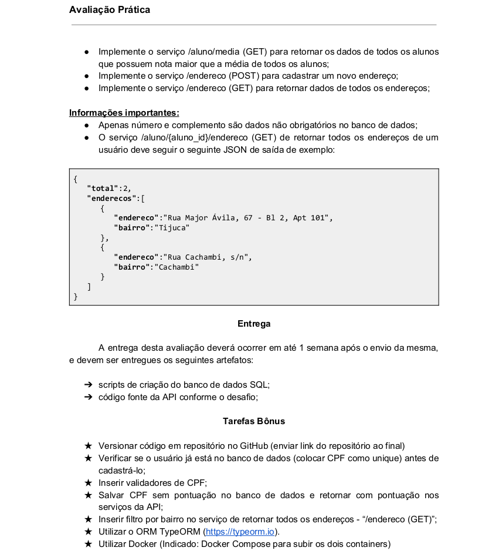

# Desafio API NestJS

É necessário executar `npm install` após clonagem ou download do repositório, de modo a instalar todas as dependências necessárias para o funcionamento da API.

Instruções do desafio original:

